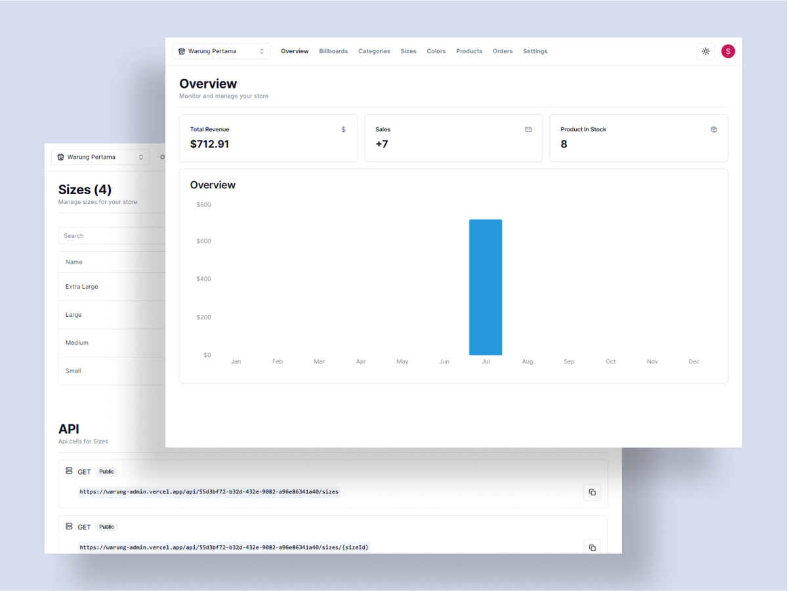

# E-Warung (Admin/API)

E-Warung Admin is a System management for E-warung webapp that provide Dashboard & API. Build with <b>Typescript, Next, Tailwind, Shadcn, Prisma, & Planetscale (mySQL)<b>

## Overview

### Screenshot



### Links

- Repo URL: [Github](https://github.com/gfsxyz/warung-admin)

- Live Site URL: [Live on Vercel](https://warung-admin.vercel.app/)

### Built with

- [Typescript](https://www.typescriptlang.org/) - JS but cooler
- [Next JS](https://nextjs.org/) - JS Framework
- [Tailwind](https://tailwindcss.com/) - Styles
- [Prisma](https://www.prisma.io/) - ORM
- [Planetscale](https://planetscale.com/) - Database
- [Clerk](https://clerk.com/) - Auth
- [Cloudinary](https://cloudinary.com/) - Media storage

## Author

- Website - [gustifaizal.com](https://gustifaizal.com/)
- Twitter - [@gfsxyz](https://twitter.com/gfsxyz)

## ⚒ Usage

### 👥 Clone the repo

```shell
$ git clone https://github.com/gfsxyz/warung-admin.git
```

### Setup

- Setup Clerk & Planetscale, Stripe, and Cloudinary accounts.

Create .env file and insert:

```
NEXT_PUBLIC_CLERK_PUBLISHABLE_KEY=<PROVIDED_BY_CLERK>
CLERK_SECRET_KEY=<PROVIDED_BY_CLERK>
NEXT_PUBLIC_CLERK_SIGN_IN_URL=/sign-in
NEXT_PUBLIC_CLERK_SIGN_UP_URL=/sign-up
NEXT_PUBLIC_CLERK_AFTER_SIGN_IN_URL=/
NEXT_PUBLIC_CLERK_AFTER_SIGN_UP_URL=/

DATABASE_URL=<PROVIDED_BY_PLANETSCALE>
NEXT_PUBLIC_CLOUDINARY_CLOUD_NAME=<PROVIDED_BY_CLOUDINARY>
STRIPE_API_KEY=<PROVIDED_BY_STRIPE>
STRIPE_WEBHOOK_SECRET=<PROVIDED_BY_STRIPE>
FRONTEND_STORE_URL=YOUR_FRONT_END_URL OR http://localhost:3001
```

### 📦 Install dependencies

```shell
$ npm install
```

### 🚀 Generate & push database schema

```shell
$ npx prisma generate

&

$ npx prisma push
```

### ✨ Start/Run the app

```shell
$ npm run dev
```
